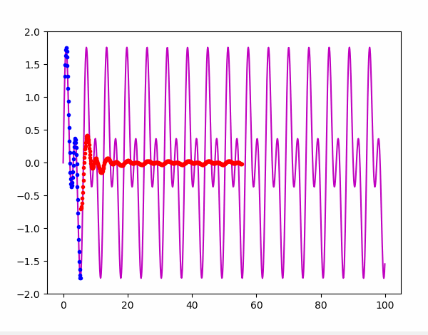
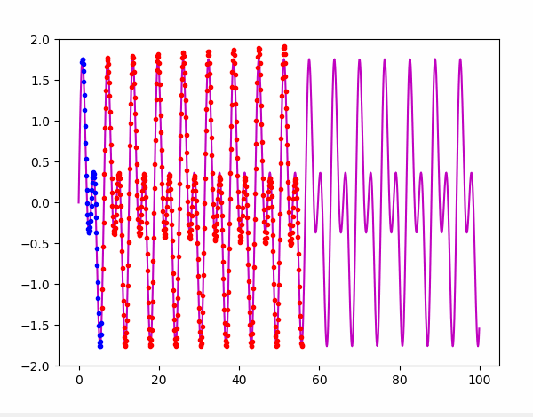

# Linear Predictor System

Implementation of a linear predictor system to predict the next values of an input signal.

The architecture of the system is a set of forward linear predictors in cascade structure:

Given an input vector with n values \[x(0), x(1), ... , x(n-1)\] and desiring m predictions:

1, x(0), x(1), ... ,   x(n-1)   -->  predictor 0  --> x(n)  
1, x(1), x(2), ... ,   x(n)     -->  predictor 1  --> x(n+1)  
1, x(2), x(3), ... ,   x(n+1)   -->  predictor 2  --> x(n+2)  
                                        .  
                                        .  
                                        .  
1, x(m-1), x(m), ... , x(n+m-2) --> predictor m-1 --> x(n+m-1)  

## Training the model

All parameters are update simultaneously or in other words: we will train one step of gradient descent for every predictor in each step of the training loop.

## Predictions

The program is configured to show, after the training, the predictions over the same training input with animated plots.

## Stability

The learning rate influences the stability of the signal predictions: we must choose a value small enough to not obtain unstable behavior and large enough to not slow down the learning speed and successfully complete the learning stage.

If the input signal is periodic: the more harmonics we have, the longer the training of the model will take.

## License

This project is licensed under the BSD 2-Clause License - see the [LICENSE](LICENSE) file for details
